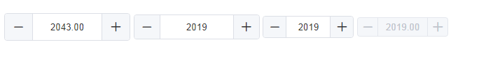
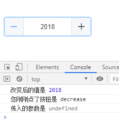
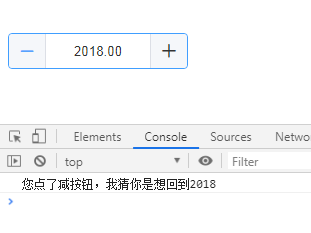
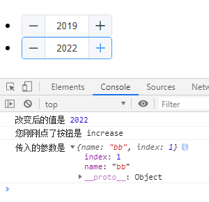

# vue-input-number
一个计数器组件，UI设计模仿了element的el-input-number组件，区别在于它可以更灵活地控制绑定值的变化，从而应用更复杂的业务逻辑<br/>
项目开发过程中，有需求需要使用计数器，但是需要知道用户点的是哪个按钮，以及在点击改变的过程中，需要对数值进行一些业务的逻辑处理，加入一些判断，并在列表中使用它，需要对它绑定一些参数，element中的计数器显然满足不了这个需求，所以我自己写了这个组件，也是阅读了element源码，加入了自己的一些功能实践。最终需求很好地得到解决。这个组件是不依赖于element的，所以放心使用。<br/>
## 使用方法：
* `npm i vue-input-number-extend` 安装    
* 在main.js中引入    
```javascript
import InputNumber from 'vue-input-number-extend'
Vue.use(InputNumber)
```
* 在.vue文件中HTML里，直接使用`<input-number></input-number>`即可
## 效果展示

### 样式效果：
      
* 按钮禁用时、输入框禁用时鼠标hover上去有禁用标志显示，并且点击无效。
* 边框颜色有过渡效果。

### 1. 简单用法:
    
HTML：  
```html
<input-number
  v-model="value1"
  @focus="onFocus"
  @blur="onBlur"
  @change="onChange"
></input-number>
```
JS：
```javascript
export default {
  data () {
    return {
      value1: 2019,
    }
  },
  methods: {
    onFocus () {
      console.log('输入框获得了焦点')
    },
    onBlur () {
      console.log('输入框失去了焦点')
    },
    onChange (value, btnType, extendParams) {
      console.log('改变后的值是', value)
      console.log('您刚刚点了按钮是', btnType)
      console.log('传入的参数是', extendParams)
    }
  }
}
```
### 2. 常用用法:
       
HTML：  
```html
<input-number
  v-model="value2"
  :min="2010"
  :max="2030"
  :step="1.5"
  size="medium"
  @focus="onFocus"
  @blur="onBlur"
  @change="onChange"
></input-number>
```
JS：
```javascript
export default {
  data () {
    return {
      value2: 2019,
    }
  },
  methods: {
    onFocus () {
      console.log('输入框获得了焦点')
    },
    onBlur () {
      console.log('输入框失去了焦点')
    },
    onChange (value, btnType, extendParams) {
      if (value > 2018 && btnType == 'decrease') {
        this.value2 = 2018
        console.log('您刚刚点了减按钮，我猜你是想直接回到2018')
      }
    }
  }
}
```
### 3. 特殊用法:
       
可以另外以对象的形式传入必要的参数参与判断逻辑（一般出现在循环列表中，在change事件中需要对某一行的数据进行单独的操作）     
HTML：  
```html
<li v-for="(item, index) in list" :key="index">
  <input-number
    v-model="item.value"
    :min="2000"
    :max="2050"
    :step="2"
    size="small"
    :extendParams="extendParams(item.name, index)"
    @focus="onFocus"
    @blur="onBlur"
    @change="onChangeSpecial"
  ></input-number>
</li>
```
JS：
```javascript
export default {
  data () {
    return {
      list: [
        {
          value: 2019,
          name: 'aa'
        },
        {
          value: 2020,
          name: 'bb'
        }
      ]
    }
  },
  methods: {
    extendParams (name, index) {
      return { name, index }
    },
    onFocus () {
      console.log('输入框获得了焦点')
    },
    onBlur () {
      console.log('输入框失去了焦点')
    },
    onChangeSpecial (value, btnType, extendParams) {
      console.log('改变后的值是', value)
      console.log('您刚刚点了按钮是', btnType)
      console.log('传入的参数是', extendParams)
      // 这里可以进行一些更多的对数据的判断和操作
    }
  }
}
```
## 参数说明

 参数  |  是否必需  |  类型  |  可选值  |  默认值  |  说明
 ---- | ---------- | ------ |  -----  |  ------ | ----
 `v-model` | 是 | number | --- | --- | 绑定的数值
 `min` | 否 | number | --- | --- | 限定最小值
 `max` | 否 | number | --- | --- | 限定最大值
 `disabled` | 否 | boolean | true, false | false | 是否禁用
 `step` | 否 | number | --- | 1 | 增加或减少的步数（可以为小数，为小数时计算结果自动保留两位小数）
 `size` | 否 | string | medium（高36px）, small（高32px）, mini（高28px） | 高40px | 大小尺寸
 `change` | 否 | 事件 | --- | --- | 绑定值被改变时触发，回调参数为（改变后的值,点击的按钮类型，传入的参数），按钮类型：点击了增加按钮返回值为'increase';点击了减按钮返回值为'decrease';如果没有点击按钮，则按钮类型值为null，若没有传入参数，则第三个参数返回值为undefined
 `blur` | 否 | 事件 | --- | --- | 输入框失去焦点时触发，回调参数（改变后的值）
 `focus` | 否 | 事件 | --- | --- | 输入框获得焦点时触发，回调参数（改变后的值）
 `extendParams` | 否 | any | --- | --- | 传入的参数， 通过change事件返回给父组件，如果未绑定，则是undefined

欢迎使用此组件，如有问题也请及时提出来我会及时更正。
